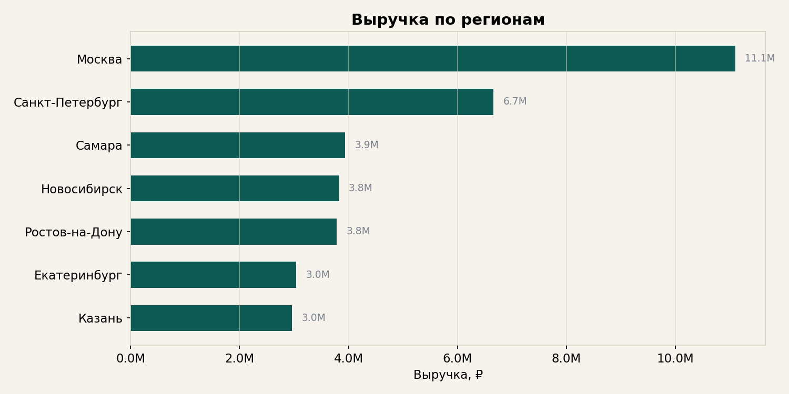
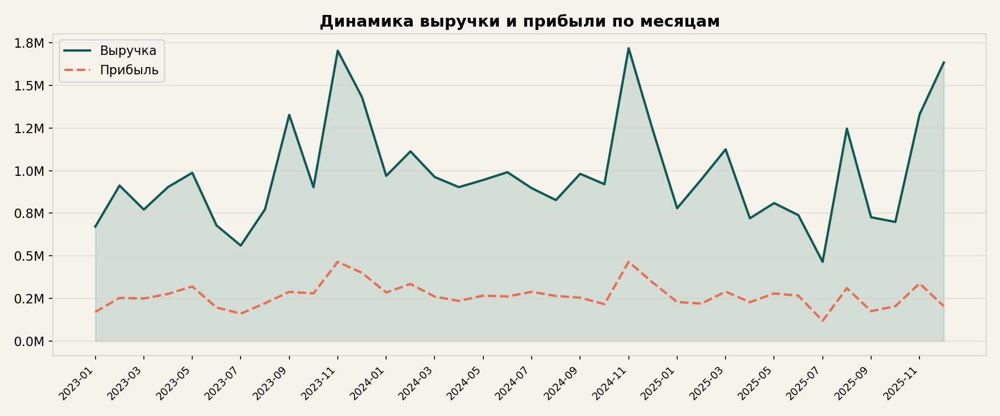
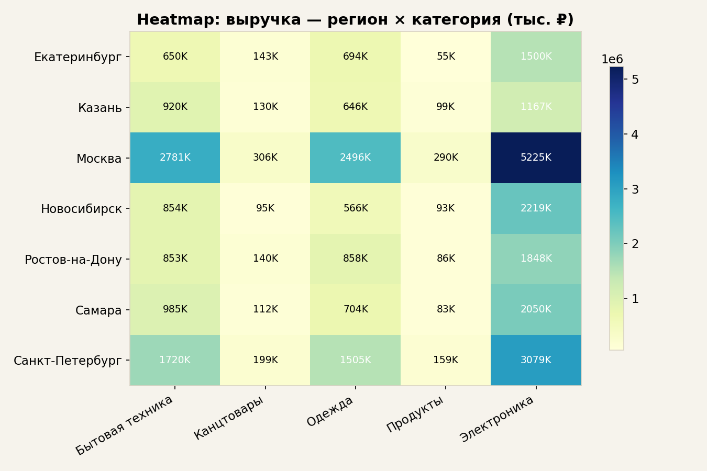
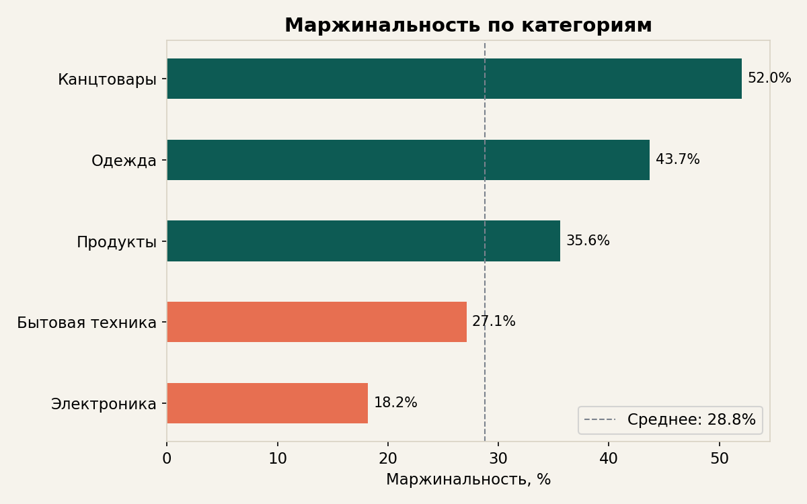

# Анализ розничных продаж · Retail Sales Analysis

Проект по анализу розничных продаж: очистка данных, агрегации, визуализация и подготовка дашборда.

**Стек:** Python · pandas · NumPy · Matplotlib · Plotly · Power BI

## Что внутри

| Файл | Описание |
|------|----------|
| `generate_data.py` | Генерация синтетического датасета (2 500 транзакций, 10 магазинов, 5 категорий, 2023–2025) |
| `retail_sales_analysis.py` | Основной скрипт анализа: очистка, groupby, pivot_table, визуализация |
| `dashboard_plotly.py` | Интерактивный дашборд на Plotly (→ `output/dashboard.html`) |
| `data/sales_data.csv` | Исходный датасет |
| `output/` | Графики (PNG) и агрегированные CSV для Power BI |
| `requirements.txt` | Зависимости |

## Навыки, которые демонстрирует проект

- **pandas**: `read_csv`, `groupby`, `pivot_table`, `fillna`, `agg`, `merge`, работа с датами (`dt.year`, `to_period`)
- **NumPy**: генерация данных, расчёты
- **Matplotlib**: bar, line, pie, heatmap, форматирование осей
- **Plotly**: интерактивный дашборд (hover, zoom, фильтры) — `output/dashboard.html`
- **Очистка данных**: обработка пропусков (заполнение медианой), валидация, расчётные столбцы
- **Бизнес-анализ**: выручка, прибыль, маржинальность, сезонность, топ-товары, региональные срезы
- **Power BI**: дашборд на основе агрегированных данных (см. `output/sales_summary_for_powerbi.csv`)

## Как запустить

```bash
pip install pandas numpy matplotlib plotly
python generate_data.py          # генерация датасета
python retail_sales_analysis.py  # анализ + графики (Matplotlib)
python dashboard_plotly.py       # интерактивный дашборд (Plotly → открыть output/dashboard.html)
```

## Примеры визуализаций

### Выручка по регионам


### Динамика выручки и прибыли


### Heatmap: регион × категория


### Маржинальность по категориям


### Интерактивный дашборд (Plotly)
Откройте `output/dashboard.html` в браузере — все графики интерактивные (наведение, зум, фильтры).

## Автор

Терехов Никита — Junior аналитик-разработчик  
dt801@mail.ru
